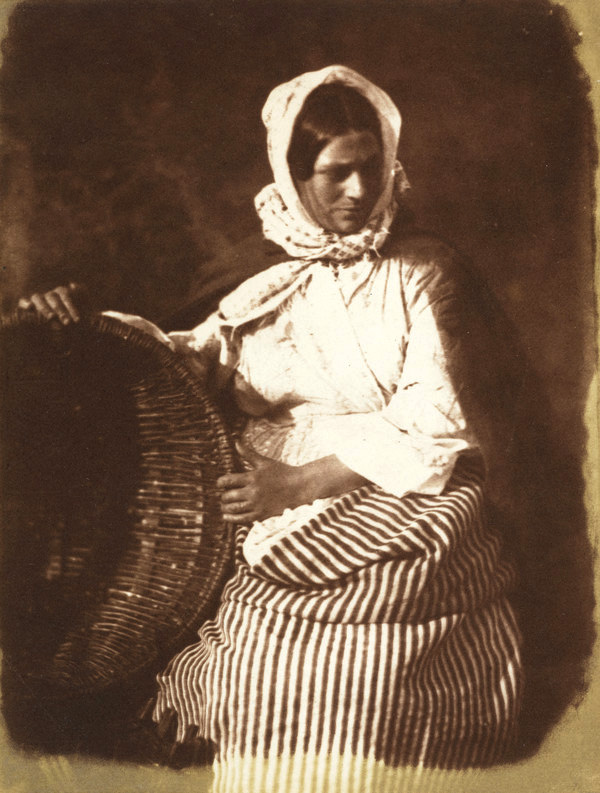
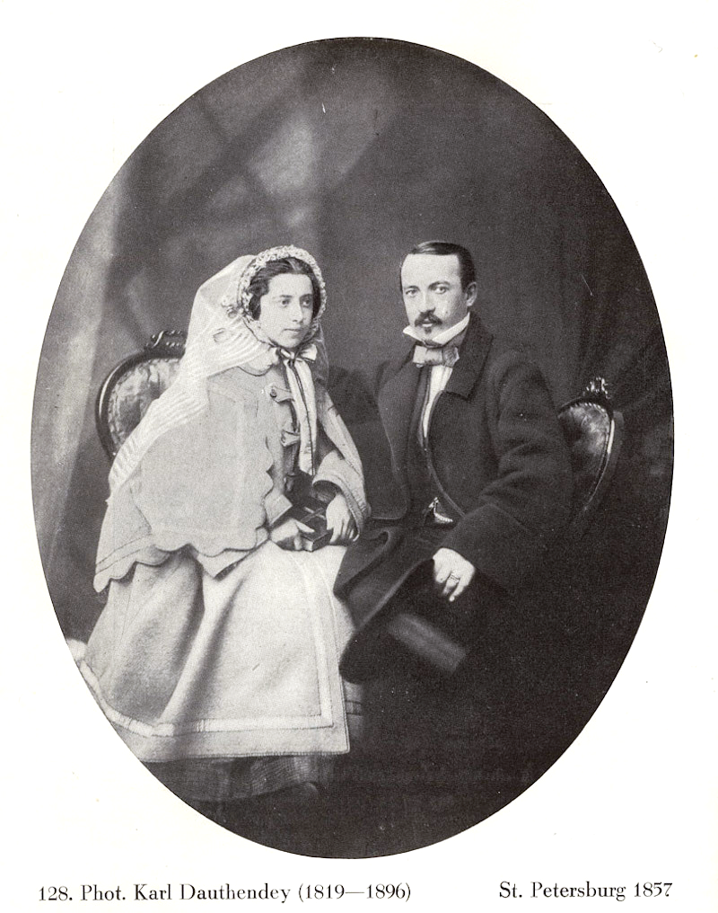
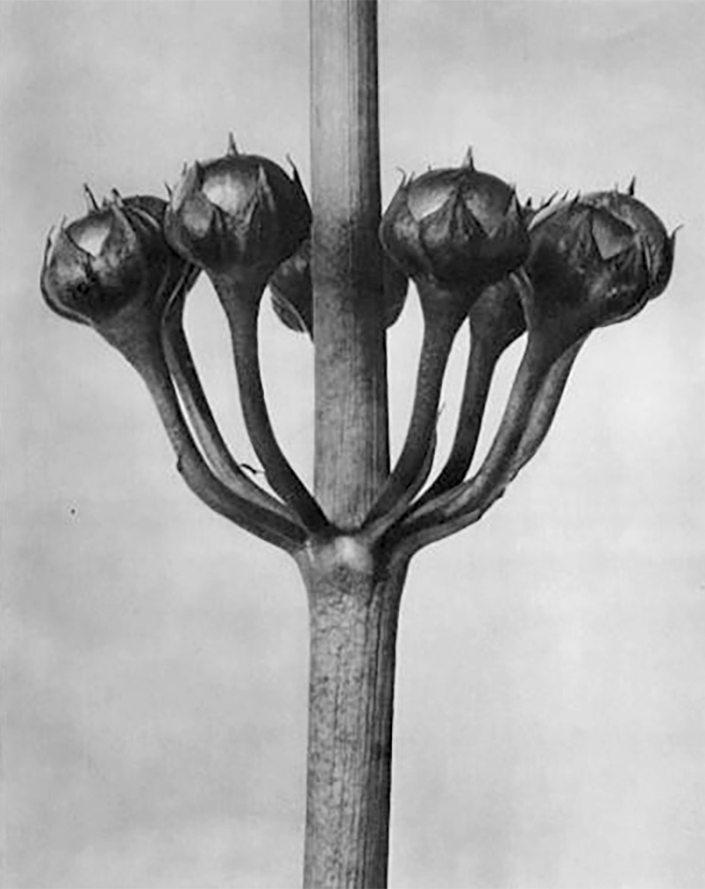
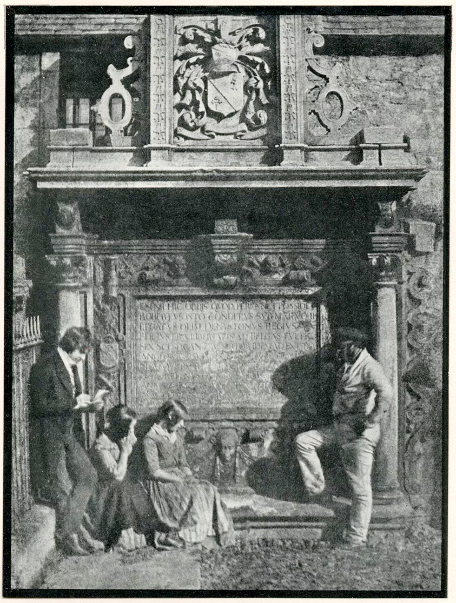
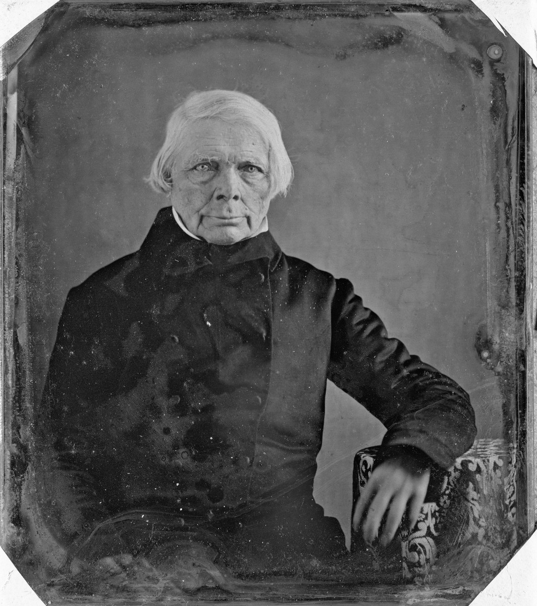
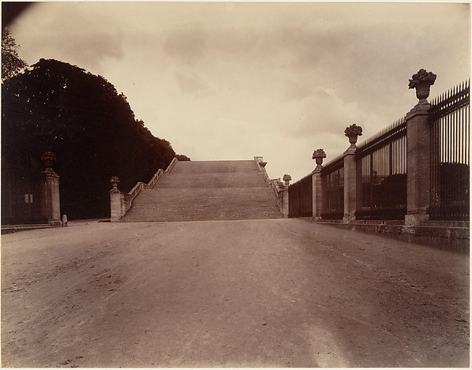
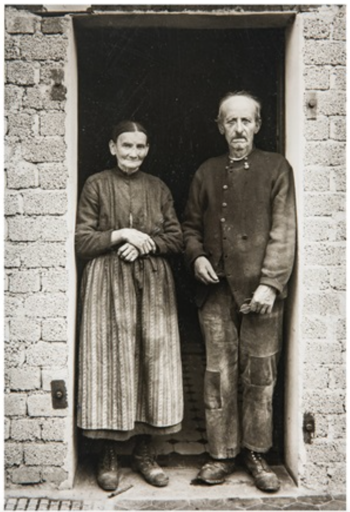

# A short history of photography

### Walter Benjamin, 1931

Translated by Stanley Mitchell

**THE FOG WHICH OBSCURES THE** beginnings of photography is not quite as thick as that which envelopes the beginnings of printing. Perhaps more discernible for photography was the fact that many had perceived that the hour for the invention had come. Independently of each other men were striving for the same goal—fixing the pictures made by a camera obscura, itself well known at least since Leonardo. When, after about five years of effort, Niépce and Daguerre succeeded at the same time, the state snatched up the invention, encouraged by patent law difficulties facing the inventors, and made it public.

With that step were established conditions for a continually accelerated pace of development which for a long time prevented any look backward. And so the historical or perhaps philosophical questions which accompany the rise and fall of photography for decades went unconsidered. If those questions are beginning to enter our consciousness today it is for a specific reason. The most recent literature seizes on the striking fact that the flowering of photography, the achievement of Hill and Cameron, of Hugo and Nadar—occurs in its first decade.[^a] That is the decade which preceded its industrialization. Not to say, of course, that in this early period the peddlers and charlatans had not gotten hold of the new technology and turned it to profit; they did that on a massive scale. But that was closer to the methods of the marketplace, where even today photography is at home, than to those of industry.

Photography first conquered the field with the visiting card, whose first producer, significantly, became a millionaire. It would not be astonishing if the types of photography which today direct our attention back to that preindustrial flourishing of photography were found to be fundamentally related to the convulsions of capitalist industry.

Nothing is easier than to utilize the attractions of pictures presented in recent publications of old photography1 for insights into photography’s basic nature. Theoretical efforts to master photography have all been thoroughly rudimentary. And however many debates were conducted about it in the last century, none broke fundamentally free from the wretched schema with which a chauvinistic little publication, the Leipzig *City Advertiser*, thought to have confronted the infernal French art early on. “To fix fleeting reflections,” it was written there, “is not only impossible, as has been shown by thoroughgoing German research, but to wish to do it is blasphemy. Man is created in the image of God and God’s image cannot be held fast by a human machine. At the most the pious artist—enraptured by heavenly inspiration—may at the higher command of his genius dare to reproduce those divine/human features in an instant of highest dedication, without mechanical help.”

Here, with all the weight of its dullness, enters the philistine’s concept of *art*, to which any technical development is totally foreign, which, with the provocative challenge of the new technology, feels its own end nearing. Nevertheless it was this fetishistic, fundamentally anti-technological concept of art with which the theoreticians of photography sought for almost a hundred years to do battle, naturally without coming to the slightest result. For this view understood nothing except to accredit the photographer before the exact tribunal he had overthrown.

An entirely different air, however, breathes through the argument which the physicist Arago, as spokesman for the invention of Daguerre, put before the chamber of deputies on the third of July 1839. The beauty of this speech is how it pointed out photography’s applications to all aspects of human activity. The panorama it sketches out is broad enough to make painting’s doubts about photography’s credentials—doubts not absent from the speech itself—seem inconsequential, as well as to hint at the breadth of the invention’s usefulness. “When the inventors of a new instrument,” Arago said, “turn it to the observation of nature, what they had hoped for from it always seems tiny in comparison to the succession of subsequent discoveries which it contributes.” This speech traverses the broad spectrum of the new technology, from astrophysics to philology; beside the prospects of photography of the stars stands the idea of assembling a body of Egyptian hieroglyphics by photography.

Daguerre’s photographs were iodized silver plates exposed in the camera obscura which could be turned back and forth until, in the proper light, one could make out a delicate, light gray image. They were unique and they cost, on the average, 25 gold francs per plate. They were frequently kept in cases as decorations. In the hands of many painters they became technical aids. Just as 70 years later, Utrillo created his fascinating views of the houses on the edges of Paris not from nature but from landscape photos, so the respected English portrait painter, David Octavius Hill, based his painting of the first general synod of the Scottish church in 1843 on a large group of portrait photographs.

But he made these photographs himself. Modestly conceived as aids for his own use, they are what gave his name historical significance, while as a painter he is forgotten. To be sure, there are a few studies which reveal more about the new medium than that series of heads: not the portraits but nameless images of people. There had been such faces in painting for a long time. If they remained in the possession of the family, then people inquired after the identity of the people represented time and time again. But after two or three generations such interest subsided: the pictures, inasmuch as they survived, did so only as testimony to the art of the painter.

In photography, however, one encounters something strange and new: in that fishwife from Newhaven who looks at the ground with such relaxed and seductive shame something remains that does not testify merely to the art of the photographer Hill, something that is not to be silenced, something demanding the name of the person who had lived then, who even now is still real and will never entirely perish into *art*. “Und ich frage: wie hat dieser haare zier / und dieses blickes die frueheren wesen umzingelt / wie dieser mund hier geküsst zu dem die begier / sinnlos hinan als rauch ohne flamme sich ringelt.”[^b] Or one comes upon the picture of Dauthendey—the photographer and father of the poet—from around the time of his wedding, seen with the wife whom one day shortly after the birth of their sixth child he found in the bedroom of his Moscow house with arteries slashed. She is seen beside him here, he holds her; her glance, however, goes past him, directed into an unhealthy distance. If one concentrated long enough on this picture one would recognize how sharply the opposites touch here. This most exact technique can give the presentation a magical value that a painted picture can never again possess for us. All the artistic preparations of the photographer and all the design in the positioning of his model to the contrary, the viewer feels an irresistible compulsion to seek the tiny spark of accident, the here and now.

In such a picture, that spark has, as it were, burned through the person in the image with reality, finding the indiscernible place in the condition of that long past minute where the future is nesting, even today, so eloquently that we looking back can discover it. It is a different nature which speaks to the camera than speaks to the eye: so different that in place of a space consciously woven together by a man on the spot there enters a space held together unconsciously. While it is possible to give an account of how people walk, if only in the most inexact way, all the same we know nothing definite of the positions involved in the fraction of a second when the step is taken.

Photography, however, with its time lapses, enlargements, etc. makes such knowledge possible. Through these methods one first learns of this optical unconscious, just as one learns of the drives of the unconscious through psychoanalysis. Concern with structure, cell forms, the improvement of medicine through these techniques: the camera is ultimately more closely related to these than to the moody landscape or the soulful portrait. At the same time, however, photography opens up in this material the physiognomic aspects of the world of images, which reside in the smallest details, clear and yet hidden enough to have found shelter in daydreams. Now, however, large and formulatable as they have grown, they are able to establish the difference between technology and magic as a thoroughly historical variable. Thus Blossfeldt,[^2] with his astonishing photographs of plants, brought out the forms of ancient columns in horsetails, the bishop’s staff in a bunch of flowers, totem poles in chestnut and acorn sprouts enlarged ten times, gothic tracery in teasel.

Therefore, too, Hill’s models are certainly not far from the truth when they admit that to them “the phenomenon of photography” was still “a great secret experience,” even if what that meant was only the consciousness of standing “before an apparatus which in almost no time could produce an image of the visible world that seemed as lifelike and truthful as nature itself.” It has been said that Hill’s camera maintained a discreet reserve. But his models, for their part, are no less reserved; they maintain a certain shyness in the face of the apparatus. The motto of a later photographer, from the period of photography’s bloom—”Never look at the camera”—could have been derived from their stance. But by that was not meant the same “looking at you” of animals, men, or babies all crowded together, which involves the customer in such an unsavory manner and to which nothing can better be contrasted than the sense with which old Dauthendey spoke of the daguerreotype: “At first one does not trust himself,” he reported, “to look for very long at the first pictures he has made. One shies away from the sharpness of these people, feels that the puny little faces of the people in the pictures can see him, so staggering is the effect on everyone of the unaccustomed clarity and the fidelity to nature of the first daguerreotypes.”

These first to be photographed enter the viewing space unfamed or, rather, uncaptioned. Newspapers, then, were still items of luxury, which one seldom bought but rather looked at in cafes. The photographic procedure had not yet become a tool of theirs; the fewest possible people even saw their names in print. The human face had a silence about it in which its glance rested. In short, all possibilities of this portrait art rested upon the fact that the connection between actuality and photo had not yet been entered upon. Many images by Hill were taken at the Edinburgh cemetery of Greyfriars. Nothing is more representative of this early period: it is as if the models were at home in this cemetery. And the cemetery, according to one picture that Hill made, is itself like an interior, a delineated, constricted space where gravestones lean on dividing walls and rise out of the grass floor—gravestones hollowed out like fireplaces showing in their hearts the strokes of letters instead of tongues of flame.

But this place could never have achieved its great effect had not its selection been for technical reasons. The lower sensitivity to light of the early plates made necessary a long period of exposure in the open. This, on the other hand, made it desirable to station the model as well as possible in a place where nothing stood in the way of quiet exposure. “The synthesis of expression which was achieved through the long immobility of the model,” Orlik says of the early photographs, “is the chief reason besides their simplicity why these photographs, like well drawn or painted likenesses, exercise a more penetrating, longer-lasting effect on the observer than photographs taken more recently.” The procedure itself caused the models to live, not *out of* the instant, but *into* it; during the long exposure they grew, as it were, into the image.

They can be sharply contrasted to the snapshot, which corresponds to the changed environment in which, as Kracauer has accurately remarked, the same fraction of a second that the exposure lasts determines “whether an athlete becomes famous enough for the photographers of the illustrated magazines to take his picture.”

Everything in these early pictures was set up to last; not only the incomparable grouping of the people—whose disappearance was certainly one of the most precise symptoms of what happened to society in the second half of the century—even the folds that a garment takes in these images persists longer. One needs only look at Schelling’s coat; it enters almost unnoticed into immortality; the forms which it assumes on its wearer are not unworthy of the folds in his face. In short, everything speaks to the fact that Bernhard van Brentano suspected: “that a photographer of 1850 was on the highest level of his instrument”—for the first and for a long time for the last time.

In order to understand the powerful effect of the daguerreotype in the age immediately following its discovery one must consider that the *plein air* painting of that time had begun to show entirely new perspectives to the most advanced painters. Aware that even in this area photography had to take the torch from painting, Arago said in a historical review of the early experiments of Giovanni Battista Porta: “As far as concerns the effect which depends on the incomplete transparency of our atmosphere (and which has been labeled with the inaccurate expression ‘air perspective’), the practiced painter does not hope that the camera obscura”—he means of the copying of the images that appear in the camera obscura—”could be helpful to him in reproducing this effect exactly.” At the moment when Daguerre succeeded in fixing the images in the camera obscura the painter had been distinguished on this point from the technician.

The genuine victim of photography, however, was not landscape painting but the miniature portrait. Things developed so swiftly that as early as 1840 most of the innumerable painters of miniatures had become professional photographers, at first only on the side but soon, however, exclusively. At the same time the experience of their original profession came in handy. It was not their preparation in art but in craft to which the high level of their photographic accomplishments must be credited. Very gradually this transitional generation disappeared; indeed there seems to have been a sort of Biblical blessing on those first photographers: Nadar, Stelzner, Pierson, Bayard all lived to ninety or a hundred. Finally, however, businessmen from everywhere entered the ranks of professional photographers. Later, when retouching of the negative—through which bad painters took their revenge on photography—gradually became practiced, a sudden decline in taste set in. Then was the time when photograph albums began to appear. In the coldest places in the house, on consoles or gueridons in the drawing room, they were most likely to be found: leather covered with metal latches and gilt-edged pages as thick as a finger on which the foolishly draped or embellished figures were distributed—Uncle Alex and Aunt Riekehe, Trudy when she was little, Papa in his first semester. And finally to make the shame complete, we ourselves: as salon Tiroleans, yodeling, hats swinging against painted firs, or as sailors, one leg straight and the other bent, as is appropriate, leaning against an upholstered post.

The accessories in such portraits, with the columns, balustrades and little oval tables, recall the time when one had to give the models points of support so they could remain steady during the long exposure. If in the beginning people were satisfied simply with head holders or knee braces, soon additional accessories followed, such as were present in famous paintings and therefore had to be artistic. Next came the columns or the curtain. Even in the ’60s accomplished men protested against this junk. It was said at the time in an English professional journal: “In painted pictures the columns appear plausible, but the manner in which they are applied to photography is absurd, for they usually stand on a rug. But as everyone knows, marble or stone columns are not commonly built with carpet as their base.” At that time arose the ateliers with their draperies and palms, gobelins and easels, which stand so ambivalently between execution and representation, torture chamber and throne room, as an early portrait of Kafka testifies.

There in a narrow, almost humiliating child’s suit, overburdened with braid, stands the boy, about six years old, in a sort of winter garden landscape. Palm fronds stand frozen in the background. And as if it were important to make these upholstered tropics even more sticky and sultry, the model holds a huge hat with broad brim like those Spaniards wear in his left hand. He would surely vanish into this arrangement were not the boundlessly sad eyes trying so hard to master this predetermined landscape.

This picture in its immeasurable sadness forms a pendant to the early photographs in which people did not yet look out into a world as isolated and godforsaken as the boy here. There was an aura around them, a medium that gives their glance the depth and certainty which permeates it. And again the technical equivalent lay close at hand; it was the absolute continuum from brightest light to darkest shadow. Here, too, the law holds good concerning the advance announcement of new achievements in the older technology, in that portrait painting—before its decline—had produced a unique flourishing of the mezzotint.

The mezzotint method involves a technique of reproduction such as was united only later with the new photographic one. As in mezzotints the light in Hill’s work torturously wrestles its way out of the dark: Orlik speaks of the “light’s holding together” because of the long duration of the exposure which gives “these early photographs their greatness.” And among the contemporaries of the invention, Delaroche remarked on the “delicate, innovative” impression which “in no way disturbed the repose of the masses.” So much for the technical conditions of this auralike impression.

Many group pictures in particular retain a fleeting togetherness which appeared for a short while in the plate, before it disappeared in the original subject. It is this breathy halo, circumscribed beautifully and thoughtfully by the now outmoded oval shape of the frame. Therefore these incunabula of photography are often misrepresented by emphasis on the *artistic perfection* or *tastefulness* in them. These images were taken in rooms where every customer came to the photographer as a technician of the newest school. The photographer, however, came to every customer as a member of a rising class and enclosed him in an aura which extended even to the folds of his coat or the turn of his bow tie. For that aura is not simply the product of a primitive camera. At that early stage, object and technique corresponded to each other as decisively as they diverged from one another in the immediately subsequent period of decline. Soon, improved optics commanded instruments which completely conquered darkness and distinguished appearances as sharply as a mirror.

The photographers in the period after 1880 saw their task in simulating that aura through all the arts of retouching, in particular through what was called offsetting. The conquest of darkness by increased illumination had eliminated the aura from the picture as thoroughly as the increasing alienation of the imperialist bourgeoisie had eliminated it from reality. So a duskier tone, interrupted by artistic reflections, became fashionable, as in *Jugendstil*. Despite the weak light, the pose was always more clearly defined; its stiffness betrayed the impotence of that generation in the face of technical progress.

Thus, what is decisive in these photographs is always the relation of the photographer to his technique. Camille Recht indicated as much in a nice image. “The violinist,” he wrote, “must form the tone himself, must seek it, find it quick as lightning; the pianist strikes the key: the tone resounds. An instrument is at the disposal of the painter as well as the photographer. The drawing and coloring of the painter correspond to the tone formation of the violin; the photographer shares with the pianist a mechanism which is subject to laws of limitation that the violinist is not. No Paderewski will ever earn the fame or work the almost legendary magic of a Paganini.”

Continuing the comparison, however, there is a Busoni of photography, and that is Atget.[^c] Both were virtuosos but at the same time forerunners. They hold in common an unmatched devotion connected with the highest precision. Even their features were similar. Atget was an actor who became disgusted with that pursuit, took off his mask and then went on to strip the makeup from reality as well. He lived in Paris poor and unknown. He gave his photographs away to admirers who could hardly have been less eccentric than he, and he died having left behind an oeuvre of more than 4,000 photographs. Berenice Abbot from New York collected these, and a selection of them has appeared in a marvelously beautiful volume published by Camille Recht.[^3]

Contemporary journalism “knew nothing of the man who mostly went around the ateliers with his pictures, throwing them away for a few pennies, often only for the price of one of those picture postcards, such as showed the sights of the city around 1900, beautifully dipped in blue night, with retouched moon. He reached the pole of the highest mastery; but in the obstinate capacity of one of great ability who always lived in the shadows, he neglected to plant his flag there. So many may believe to have discovered the pole which Atget reached before them.”

In fact, Atget’s Paris photographs are the forerunners of Surrealist photography, advance troops of the broader columns Surrealism was able to field. As the pioneer, he disinfected the sticky atmosphere spread by conventional portrait photography in that period of decline. He cleansed this atmosphere, he cleared it; he began the liberation of the object from the aura, which has been the achievement of the most recent school of photography. When *Bifur* or *Variété* periodicals of the avant-garde, were showing mere details under the captions “Westminster,” “Lille,” “Antwerp,” or “Breslau,” a piece of a balustrade, a bare treetop whose twigs cut across a gas lantern, a stone wall, or a candelabra with a life ring on which the name of the city is written, they are showing nothing but refinements of motifs which Atget discovered. He sought the forgotten and the neglected, so such pictures turn reality against the exotic, romantic, show-offish resonance of the city name; they suck the aura from reality like water from a sinking ship.

What is aura? A strange web of time and space: the unique appearance of a distance, however close at hand. On a summer noon, resting, to follow the line of a mountain range on the horizon or a twig which throws its shadow on the observer, until the moment or hour begins to be a part of its appearance—that is to breathe the aura of those mountains, that twig. Now to bring things themselves closer—and closer to the masses—is as passionate a contemporary trend as is the conquest of unique things in every situation by their reproduction. Day by day the need becomes greater to take possession of the object—from the closest proximity—in an image and the reproductions of an image. And the reproduction, as it appears in illustrated newspapers and weeklies, is perceptibly different from the original. Uniqueness and duration are as closely entwined in the latter as transience and reproducibility in the former. The removal of the object from its shell, the fragmentation of the aura, is the signature of a perception whose sensitivity for similarity has so grown that by means of reproduction it defeats even the unique.

Atget almost always passed by the “great sights and the so-called landmarks.” He did not, however, pass by a long row of boot lasts, or by the Parisian courtyards where from evening until morning hand-wagons stand in rows and groups; or by the uncleared tables and the uncollected dishes, which were there at the same time by the hundred thousands all over; or by the bordello at rue . . . no. 5, whose gigantic five appears in four different places on the facade. More noticeably, however, almost all of these pictures are empty. The Porte d’Arcueil fortifications are empty, as are the regal steps, the courts, the terrace cafes, and as is appropriate, the Place du Tertre, all empty.

They are not lonely but voiceless; the city in these pictures is swept clean like a house which has not yet found its new tenant. These are the sort of effects with which Surrealist photography established a healthy alienation between environment and man, opening the field for politically educated sight, in the face of which all intimacies fall in favor of the illumination of details. It is plain that this new vision had least absorbed what one would otherwise most understandably indulge in—the devalued representative portrait. On the other hand, the renunciation of the human image is the most difficult of all things for photography. The best Russian films taught those who did not know this that milieu and landscape only make themselves accessible to photographers who know how to grasp them in the nameless manifestations which they take in the face. Even the possibility of that is conditioned by the subject of the photograph. It was a generation which had no ambition to go down for posterity in pictures, but rather withdrew in the face of such possibilities into its living space, somewhat shyly—like Schopenhauer, in the Frankfurt picture of around 1850, receding into the depths of his armchair. Just for that reason this generation let its living space enter with it into the picture, but it did not bequeath its graces. Then for the first time in decades the Russian film provided an opportunity to show people in front of the camera who were not being photographed for their own purposes. And suddenly the human face entered the image with a new, immeasurable significance. But it was no longer a portrait. What was it?

It is the supreme accomplishment of a German photographer to have answered this question. August Sander[^4] put together a series of faces that in no way stand beneath the powerful physiognomic galleries that an Eisenstein or a Pudovkin revealed, and he did so from a scientific standpoint. “His total work forms seven groups, which correspond to the existing order of society, and are to be published in about 45 portfolios of 12 photos each.”[^d] Sander goes from farmers, the earthbound men, and takes the viewer through all levels and professions up on one hand to the highest representatives of civilization and down on the other to idiots. The creator came to this task not as a scholar nor instructed by racial theoreticians or social researchers, but, as the publisher says, “from direct experience.” The observation is certainly an unprejudiced one, but clever, also, and tender and sensitive in the sense of Goethe’s statement: “There is a sensitive empiricism which makes itself most inwardly identical with the object and thereby becomes genuine theory.” Therefore it is completely in order that an observer like Döblin struck straightaway onto the scientific aspects in this work and remarked: “As there is a comparative anatomy by virtue of which we come to a conception of nature and a history of organs, so this photographer pursues comparative photography and thereby achieves a scientific standpoint above and beyond that of photographic details.”

It would be a shame if economic conditions prevented the further publication of this extraordinary corpus. To the publisher, however, we can offer a more specific encouragement in addition to general ones: overnight, works like those of Sander can grow into unsuspected actuality. Power shifts, such as we face, generally allow the education and sharpening of the physiognomic conception into a vital necessity. One may come from the right or from the left—he will have to get used to being viewed according to where he comes from. One will have to see others the same way. Sander’s work is more than a book of pictures: it is a book of exercises.

“There is no work of art in our age so attentively viewed as the portrait photography of oneself, one’s closest friends and relatives, one’s beloved,” Lichtwark wrote as early as 1907, and thereby moved the investigation out of the realm of esthetic distinctions into that of social functions. Only from that angle can it strike out further. It is significant that the debate becomes stubborn chiefly where the esthetics of *photography as art* are involved, while for example the much more certain social significance of *art as photography* is hardly accorded a glance.

And the effect of photographic reproduction of works of art is of much greater importance for the function of art than the more or less artistic figuration of an event which falls prey to the camera. Indeed the amateur returning home with his mess of artistic photographs is more gratified than the hunter who comes back from his encounters with masses of animals which are useful only to the trader. And the day seems to stand before the door when there will be more illustrated periodicals for photographers than game and poultry shops. So much for snapshots.

But the accents change completely if we turn from looking at photography as art to art as photography. Anyone will be able to observe how much more easily a painting and above all, a sculpture, or architecture, can be grasped in photographs than in reality. The temptation is to attribute this to the decay of contemporary artistic perception. But preventing it is the recognition that at about the same time as the formation of the technology for reproduction the conception of great works was changing. One can no longer view them as the productions of individuals; they have become collective images, so powerful that capacity to assimilate them is related to the condition of reducing them in size. In the final effect, the mechanical methods of reproduction are a technology of miniaturization and help man to a degree of mastery over the works without which they no longer are useful.

If any one of the current relations between art and photography is clear, it is the unsettled tension which comes between the two through the photography of works of art. Many of those photographers who determine the current aspects of this technique came from painting. They turned their backs on that medium of expression after efforts to put it in a clear, living connection with contemporary life. The more aware their sense of the nature of the times, the more problematic has grown their point of departure. For again, as 80 years ago, photography picked up the torch from painting. “The creative possibilities of the new,” Moholy Nagy said, “are mostly discovered slowly, through old forms, old instruments, old structures which are fundamentally injured by the appearance of new things but which, under the pressure of the new, emerging things, are driven up into a last, euphoric flourishing.

“So, for example, futurist painting delineated the self-destructive, tightly constricted problematic of simultaneity of motion, the figuration of the moment in time; and this at a moment when film was known but for a long time would still not be understood. Just so, one can—with caution—view a few of the painters working today in representative, objective modes (Neoclassicists and veristes) as forerunners of a new, representative, optical figuration which uses only mechanical, technical means.” And Tristan Tzara, 1922: “When everything that called itself art grew palsied, the photographer ignited his thousand-candle-power lamp and step by step the light sensitive paper absorbed the blackness of a few useful objects. He discovered the carrying power of a tender delicate untouched flash, which was more important than all the constellations given us to soothe our sight.” The photographers who came to photography out of the comfort of the plastic arts, not out of opportunistic daring, not accidentally, today form the avant-garde among their colleagues, because they are to some degree assured by their course of development against the greatest danger of current photography, the tendency toward the applied arts. “Photography as art,” says Sasha Stone, “is very dangerous territory.”

When photography has extracted itself from the connections that a Sander, a Germaine Krull, a Blossfeldt gave it, when it has emancipated itself from physiognomic, political, scientific interests—that is when it becomes “creative.”

Concern for the objective becomes merely *juxtaposition*; the photographic artist’s smock makes its entrance. “Spirit, conquering mechanics, gives a new interpretation to the likenesses of life.” The more the crisis of current social order expands, the more firmly moments enter into oppositions against each other, the more the creative principle—by nature a deep yearning for variants, contradiction its father, imitation its mother—is made a fetish, whose features owe their life only to fashionable changes of lighting. The “creative” principle in photography is its surrender to fashion. Its motto: the world is beautiful. In it is unmasked photography, which raises every tin can into the realm of the All but cannot grasp any of the human connections that it enters into, and which, even in its most dreamy subject, is more a function of its merchandisability than of its discovery. Because, however, the true face of this photographic creativity is advertising or association; therefore its correct opposite is unmasking or construction. For the situation, Brecht says, is complicated by the fact that less than ever does a simple *reproduction of reality* express something about reality.

A photograph of the Krupp works or of the A.E.G. reveals almost nothing about these institutions. The real reality has shifted over into the functional. The reification of human relations, for instance in industry, makes the latter no longer revealing. Thus in fact it is to *build something up*, something artistic, created.” The accomplishment of Surrealism was to have pioneered such photographic construction. A further stage in the opposition between creative and constructive photography is shown by Russian film. It is not too much to say that the great accomplishments of its directors were only possible in a country where photography did not proceed on impulse and suggestion but on experiment and instruction. In this sense—and only in it—can we still make sense today of the greeting which the rough idealist painter Antoine Wiertz offered photography in 1855: “The fame of our age was born a few years ago: a machine which, day in and day out, has been the astonishment of our thought and the terror of our eyes. Before a century has passed, this machine will be the brush, palette, colors, grace, experience, patience, dexterity, sureness, hue, varnish, sketch, completion, extract of painting. If you do not believe that the daguerreotype kills art, well, when the daguerreotype, this giant child, has grown up, when all its art and strength have been revealed, then genius will suddenly slap a hand on the back of its neck and call out loud: Here, you belong to me now! We will work together.”

How sober, even pessimistic, on the other hand, are the words in which Baudelaire, in the *Salon of 1857*, two years later, acquainted his readers with the new techniques. No more than the preceding words can they be read without a gentle shift of accent. But while they imply the opposite of Wiertz’s words, they have kept their good sense as the sharpest rebuke to all the usurpations of artistic photography: “In these lamentable days a new industry has emerged, which has helped not a little in strengthening plain stupidity in its belief . . . that art is nothing other than—and *can* be nothing other than—the exact reproduction of nature. . . . A vengeful God has heeded the voices of the crowd. Daguerre is becoming its messiah.” And: “If photography is allowed to help complete art in a few of its functions, then art will be as quickly ruined and cast out by it, thanks to the natural alliance which will grow up between photography and the crowd. It must therefore return to its own duty, which consists in being a servant girl to the sciences and the arts.”

One thing, however, was not grasped either by Wiertz or by Baudelaire, and that is the direction implicit in the authenticity of the photograph. It will not always be possible to link this authenticity with reportage, whose clichés associate themselves only verbally in the viewer. The camera will become smaller and smaller, more and more prepared to grasp fleeting, secret images whose shock will bring the mechanism of association in the viewer to a complete halt. At this point captions must begin to function, captions which understand the photography which turns all the relations of life into literature, and without which all photographic construction must remain bound in coincidences.

Not for nothing were pictures of Atget compared with those of the scene of a crime. But is not every spot of our cities the scene of a crime? every passerby a perpetrator? Does not the photographer—descendant of augurers and haruspices—uncover guilt in his pictures? It has been said that “not he who is ignorant of writing but ignorant of photography will be the illiterate of the future.” But isn’t a photographer who can’t read his own pictures worth less than an illiterate? Will not captions become the essential component of pictures? Those are the questions in which the gap of 90 years that separates today from the age of the daguerreotype discharges its historical tension. It is in the light of these sparks that the first photographs emerge so beautifully, so unapproachably from the darkness of our grandfathers’ days.

---

NOTES

[^1]: Helmuth Th. Bossert and Heinrich Guttmann, *Aus der Frühzeit der Photographie*, 1840–1870. A Volume of Pictures From 200 Originals. Frankfurt, 1930. Heinrich Schwarz, *David Octavius Hill, der Meister der Photographie*. With 80 plates. Leipzig, 1931.
[^2]: Karl Blossfeldt, *Urformen der Kunst*. Photographs of Plants. Published with an introduction by Karl Nierendorf. 120 plates. Berlin, 1930.
[^3]: Atget, *Photographs*. Published by Camille Recht, Paris and Leipzig, 1931.
[^4]: August Sander, *Das Antlitz der Zeit*, Berlin, 1930.

---

Translator’s Notes

[^a]: “Its first decade” is an exaggeration. Of the photographers Benjamin refers to Hill was the earliest (1839–49); Cameron and Nadar were not even active until the late fifties and sixties.
[^b]: “And I ask: how did that former being surround this delicate hair, this glance; how did it kiss this mouth, around which desire curls insensibly, like smoke without a flame “
[^c]: Busoni (1866–1924) was known for bringing an almost mystic form of romanticism to piano playing and composition. He experimented with exotic scales, worked out a new system of notation expressly for piano, and as a performer was praised for his sense of color and tone. He was also a teacher of Kurt Weill, who of course collaborated with Benjamin’s friend Bertolt Brecht.
[^d]: Since Benjamin’s death, Sander’s photographs have been published in Europe and in the United States in the volume *Men Without Masks*, Greenwich, Connecticut: New York Graphic Society, 1973.

