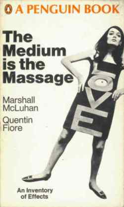

# Re-illustrating "The Medium is the Massage"



## Project Overview

This project challenges you to critically examine and reimagine McLuhan and Fiore's "The Medium is the Massage" for our contemporary media landscape using AI image generation. You'll identify outdated concepts, problematic representations, and opportunities for modernization while exploring how the medium of AI-generated art itself influences the message.

### Project Objectives
1. Analyze the original work's visual and textual elements through a contemporary lens
2. Identify and address problematic or outdated content
3. Reimagine key concepts using modern media references
4. Create new illustrations using ComfyUI/Stable Diffusion
5. Reflect on how AI as a medium affects the message

### Tools Required
- Original copy of "[The Medium is the Massage](https://drive.google.com/file/d/0BwyDePyHbx1RMzdjMGUxZjctZTI2MC00NTNiLTg1YWYtY2U2YzNjZjBkODJl/view?pli=1&resourcekey=0-ynv9L2tGhIJO4TxjcWA_YA)"
- ComfyUI with Stable Diffusion (in the lab)
- Documentation template (below)
- Image editing software (optional)

## Documentation Template

### 1. Original Illustration Analysis
**Page Number:** [Insert]
**Original Context:** [Describe the surrounding text and intended message]

**Visual Analysis:**
- Composition: [Describe layout, focal points, visual hierarchy]
- Style: [Note artistic techniques, influences]
- Typography: [Document text integration if present]
- Image-Text Relationship: [How do visuals and text work together?]

**Critical Assessment:**
- Outdated Elements: [List anachronistic references or technology]
- Problematic Aspects: [Note biased representations or assumptions]
- Successful Elements: [What still works/resonates today?]

### 2. Proposed Reimagining
**Updated Context:** [How does this connect to contemporary media?]

**Modernization Strategy:**
- Core Message: [What key point should be preserved?]
- Contemporary References: [Modern equivalents to original concepts]
- Visual Approach: [Describe intended style, composition]
- Cultural Considerations: [How to ensure inclusive representation]

### 3. AI Generation Process
**Prompt Engineering:**
```
Base Prompt:
[Your initial prompt]

Style Specifications:
[Style-related keywords]

Composition Elements:
[Layout and visual element keywords]

Technical Parameters:
[Resolution, aspect ratio, etc.]
```

**Iteration Log:**
1. First Attempt:
   - Prompt used:
   - Results:
   - Issues identified:
   - Planned adjustments:

2. Refinements:
   [Continue logging iterations]

**Final Selection:**
- Chosen Image: [Include or link to image]
- Selection Rationale: [Why this version works best]
- Post-processing: [Any additional edits made]

### 4. Critical Reflection
**Medium Analysis:**
- AI Influence: [How did AI generation affect the outcome?]
- Technical Limitations: [What constraints did you encounter?]
- Ethical Considerations: [Address any concerns about AI generation]

**Message Evolution:**
- Original vs. New: [Compare effectiveness of both versions]
- Contemporary Relevance: [How does new version resonate today?]
- Unintended Messages: [Any unexpected implications?]

### 5. Integration
**Layout Considerations:**
- Text Relationship: [How new image works with original text]
- Visual Flow: [How it fits within book's sequence]
- Technical Notes: [Any production considerations]

**Final Thoughts:**
- Success Metrics: [How well does it meet project objectives?]
- Lessons Learned: [Key takeaways from process]
- Future Iterations: [What you might do differently]

---

### Submission Checklist
- [ ] Completed analysis template for each illustration
- [ ] Original illustrations (scanned/photographed)
- [ ] AI generation process documentation
- [ ] Final generated images
- [ ] Critical reflection essay
- [ ] Technical specifications for reproduction
